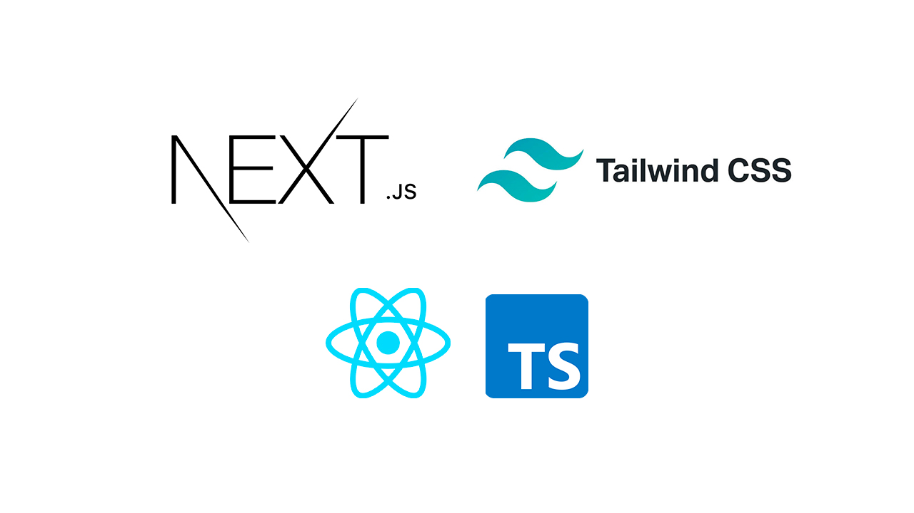

<div align="center">
  

  <h4 align="center">
     Next.js and declarative UI with TailwindCSS.
  </h4>
</div>

---

<p align="center">
  
  
</p>

## 🚀 Getting Started

To clone and run the application, you will need to have [Git](https://git-scm.com), [Node.js](https://nodejs.org) + [Yarn](https://yarnpkg.com) installed on your machine. With all programs installed, run the following command lines:

```bash
# Clone this repository
$ git clone https://github.com/MiguelMelo/nextjs-base.git

# Access the repository
$ cd nextjs-base

# Install the dependencies
$ yarn install

# Run application
$ yarn dev
```
